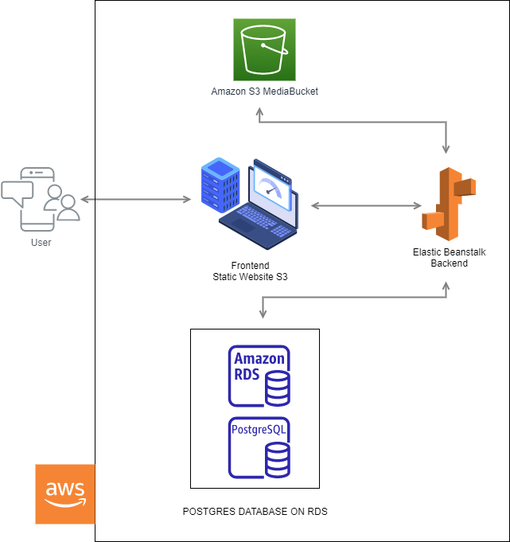

# Infrastructure:

## AWS -> RDS Porstgres, Elastic Beanstalk, S3 Bucket

- Backend hostet on AWS Elastic Beanstalk
  - URL:`udagram-api.us-east-1.elasticbeanstalk.com`
- Frontend hostet on AWS S3
  - URL: `http://udagram20221027.s3-website-us-east-1.amazonaws.com`
- Postgres database hostet on AWS RDS
  - Endpoint: `database-udagram.cjyuzdgno9wb.us-east-1.rds.amazonaws.com`

## Diagram:

