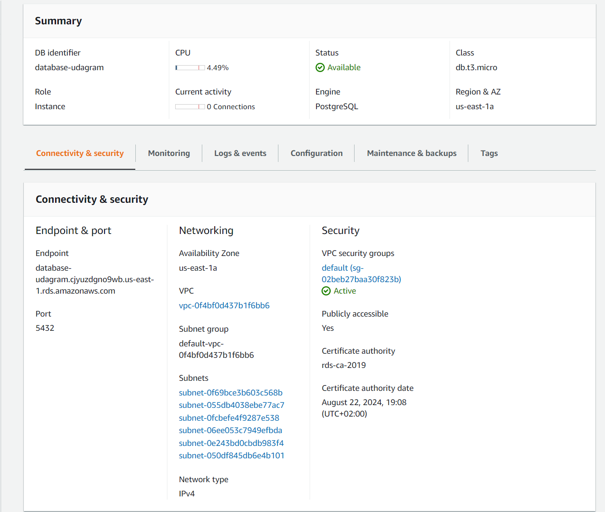
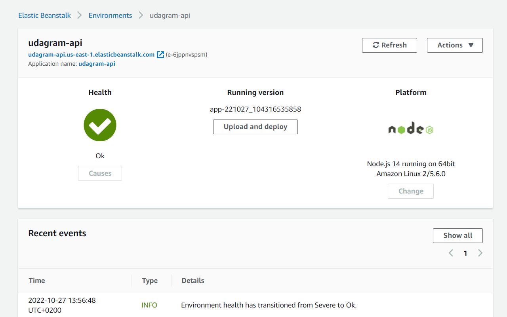
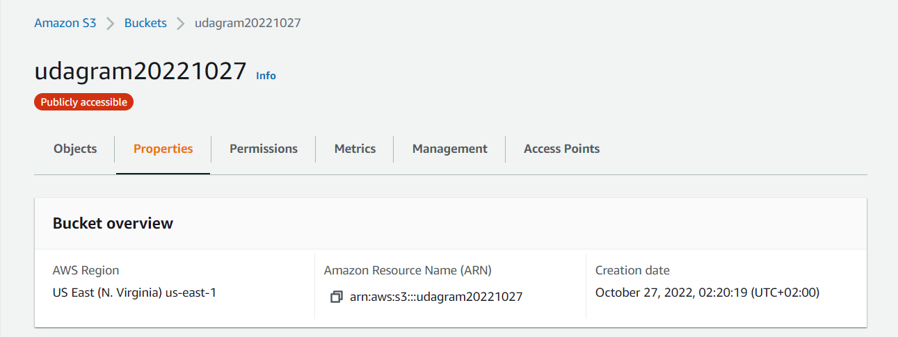
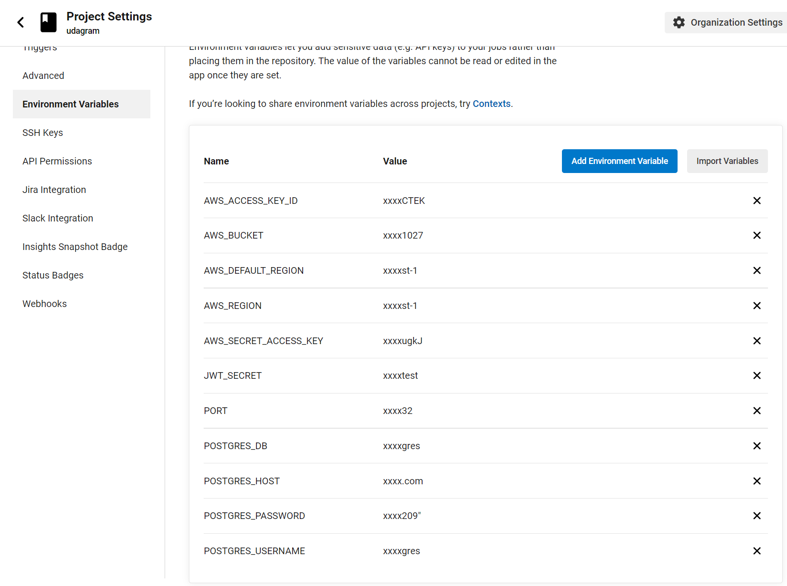
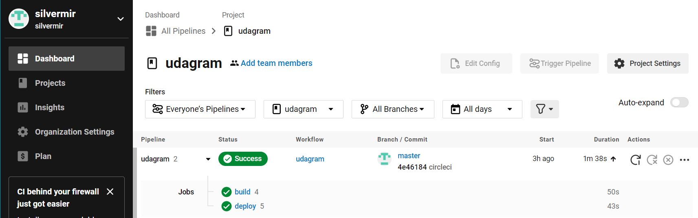
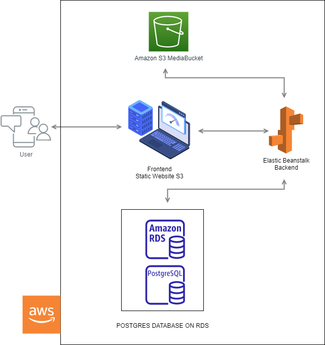

# Hosting a Full-Stack Application

# Udagram

## Description

this project was about learning how to publish a FULLSTACK application

## Frontend Link:

http://udagram20221027.s3-website-us-east-1.amazonaws.com/

## AWS Screenshots

### RDS PostgreSQL Database

### Elastic Beanstalk

### S3 Bucket

## circleci Screenshots

### ENVIRONTMENT VARIABLES

### PIPLINE

## Infrastructure

